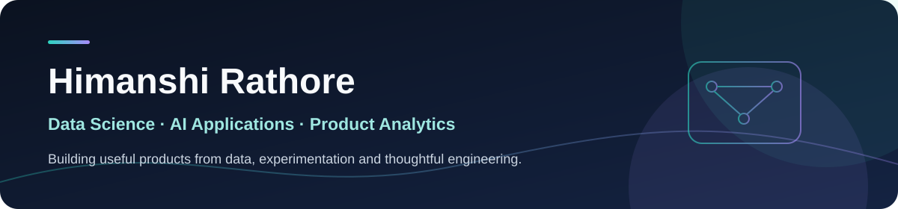

**Data Science graduate building practical AI tools and evidence-driven analytics.**

## About me

I work across **AI applications, machine learning, product analytics, and experimentation**. I enjoy taking an idea from messy data or an early prototype to a usable application, with clear assumptions and measurable results. My portfolio includes multi-agent research, bilingual public-interest software, customer analytics, and statistical decision-making.

- 🔭 **Current focus:** AI products, analytics engineering, and product experimentation
- 🧭 **Approach:** Reproducible work, clear documentation, and honest limits
- 💼 **Interested in:** Data Science, Data Analytics, and AI Engineering opportunities

## Selected projects

### 🛡️ [Niveshak Saathi](https://github.com/Himanshi252005/Niveshak-Saathi) · [Try the app](https://himanshi252005.github.io/Niveshak-Saathi/)

A Hindi-first, bilingual investor-safety companion that helps users find official complaint routes, recognize suspicious messages, and keep useful guidance available offline. Built as a lightweight web app for first-time investors.

`HTML` `CSS` `JavaScript` `Accessibility`

### 🤖 [Multi-Agent Research System](https://github.com/Himanshi252005/Multi-Agent-System) · [Live demo](https://multi-agent-system-byhimanshi.streamlit.app/)

A research workflow with specialized search, reading, writing, and critique stages. It turns a topic into a structured report through a Streamlit interface or command line.

`Python` `LangChain` `LLM APIs` `Streamlit`

### 📊 [SaaS Pulse — Customer Analytics](https://github.com/Himanshi252005/Saas-Customer-Analytics) · [Live dashboard](https://saas-pulse-himanshi.streamlit.app/)

A reproducible customer-month data pipeline and dashboard for recurring revenue, churn, and cohort retention. The data is **synthetic** and clearly labeled throughout the project.

`Python` `SQL` `DuckDB` `Streamlit`

### 🧪 [A/B Testing & Product Experimentation](https://github.com/Himanshi252005/ab-testing-product-experimentation) · [Live dashboard](https://ab-testing-himanshi.streamlit.app/)

A simulated onboarding experiment from metric design and data validation through statistical inference and a rollout recommendation. The case study shows why a conversion lift can still require a hold when a safety guardrail is uncertain. **Uses synthetic data.**

`Python` `SQL` `Statistics` `Streamlit`

## More work

| Project | Short description |
| --- | --- |
| [Job Application Copilot](https://github.com/Himanshi252005/Job-Application-Copilot) | Local job-search assistant that tailors documents from a real resume and tracks applications. |
| [AI Content Studio](https://github.com/Himanshi252005/ai-content-studio-command-center) | Full-stack editorial workspace for drafting, approval, scheduling, and evidence-linked insights. |
| [Insurance Charges Prediction](https://github.com/Himanshi252005/Insurance-Charge-Prediction) | Regression pipeline with deliberate feature engineering and held-out evaluation. |
| [Superstore Sales Analysis](https://github.com/Himanshi252005/Superstore-Sales-Analysis) | Retail analysis uncovering discount and product-category profit patterns. |
| [Emotion-Aware Music Generator](https://github.com/Himanshi252005/emotion-music-generator) | Facial-emotion analysis paired with YouTube music recommendations. |
| [Spotify Clone](https://github.com/Himanshi252005/Spotify-Clone) | Responsive front-end recreation of a music-player interface. |
| [Tic-Tac-Toe](https://github.com/Himanshi252005/Tic-Tac-Toe-Game) | Two-player browser game with win, draw, and reset logic. |

## Technical toolkit

**Analysis & data** · Python, SQL, Pandas, NumPy, DuckDB, Power BI, Excel  
**Statistics & ML** · Experiment design, hypothesis testing, regression, classification, scikit-learn  
**AI applications** · LangChain, LLM APIs, NLP, computer vision, Streamlit  
**Development** · React, TypeScript, JavaScript, HTML/CSS, Express, Prisma, SQLite, Git

---

**Have a role or project in mind?** [Connect on LinkedIn](https://www.linkedin.com/in/himanshi-rathore-hr2520/) or [send me an email](mailto:himanshirathore25102005@gmail.com).

